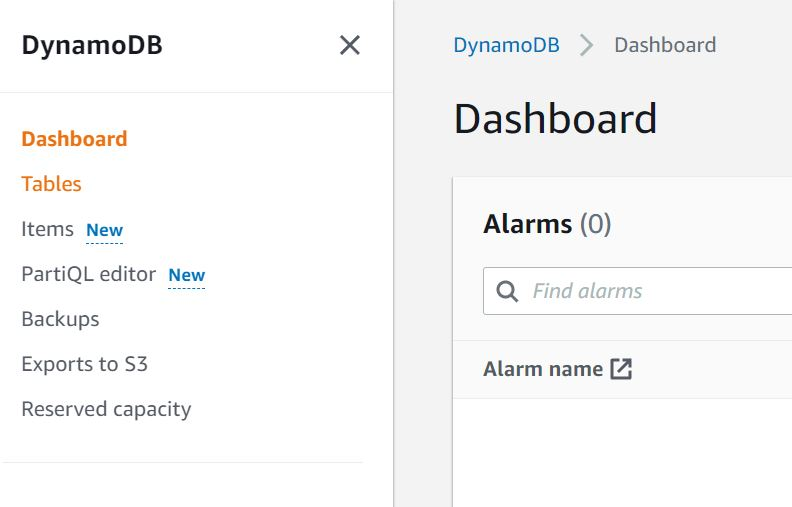
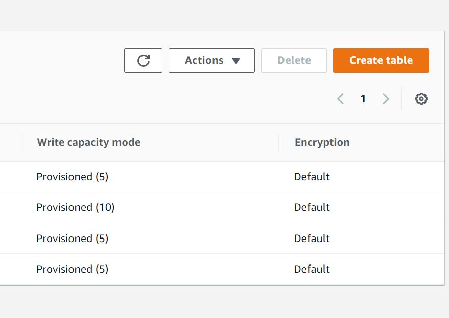
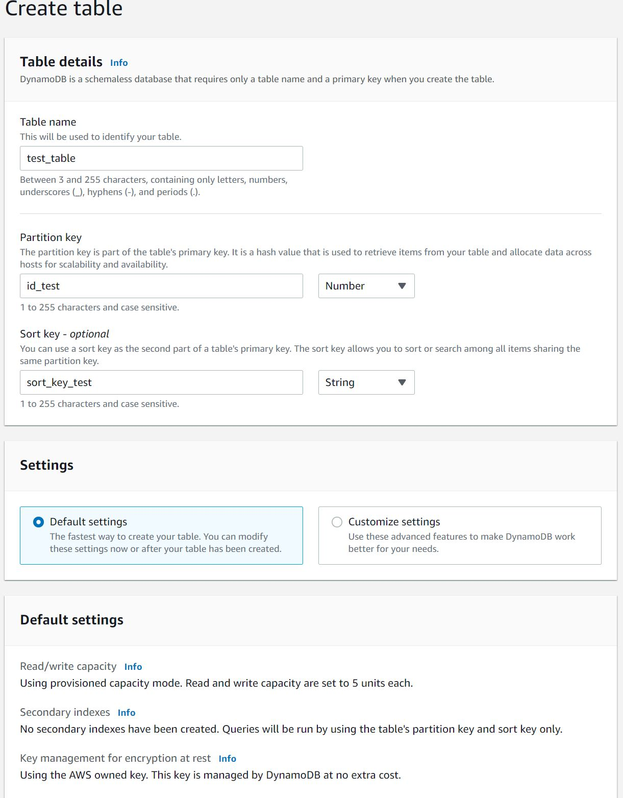
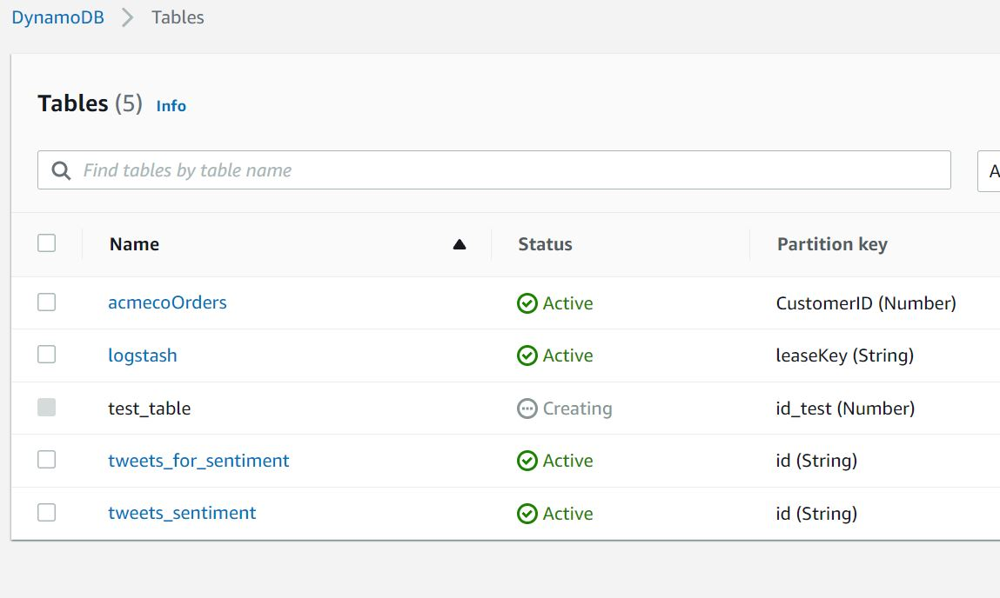
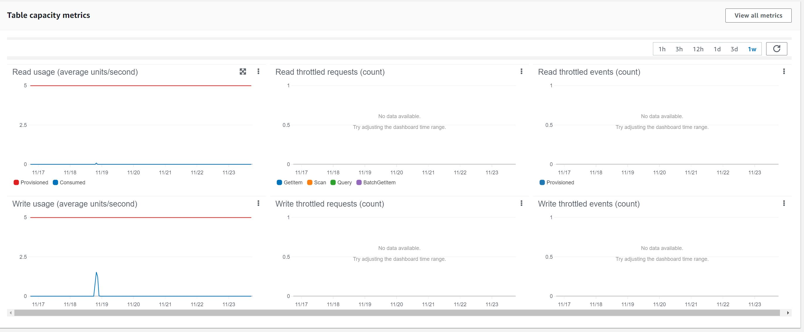
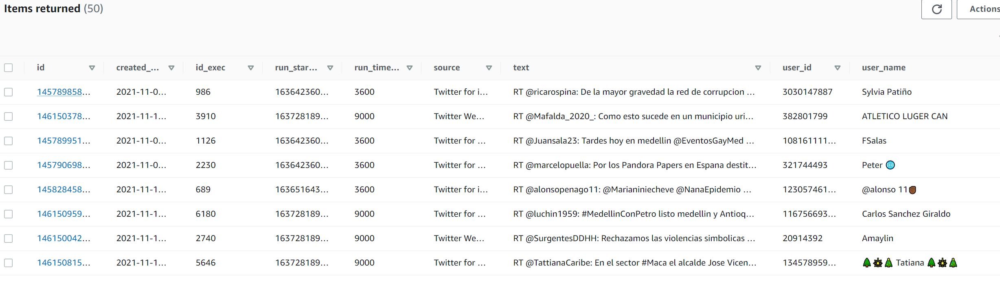

El proceso de creación de una tabla de Dynamo es muy sencillo sin embargo mostramos las tablas necesarias en nuestro proceso:

para crear una tabla de Dynamo vamos a nuestra tabla de Dynamo en AWS vamos a la consola y seleccionamos la opción de Dynamo una vez en la pantalla de Dynamo veremos el siguiente menú:

Seleccionamos la opción de tablas, el siguiente paso es

presionar el botón `Create Table`
y seguiremos la configuración base en la configuración avanzada podemos configurar el tamaño de los lotes de entrada pero esto está relacionado con la cantidad de peticiones para nuestra tabla. La mejor opción es crear la tabla y analizar las métricas de lectura y escritura para poder determinar si es necesario escalar o no.

por utimo cramos la tabla y en nuestr menu de tablas podemos observar las tablas creadas hay que tener en cuenta estos nombres porque los veremos en nuestra sección de Lambda y Kinesis en algunos casos.

podemos analizar la capacidad de nuestra tabla observando las métricas que poseen y de esta manera determinar si es necesario escalar de acuerdo a las métricas de uso, por ejemplo:

los contenidos de esta tabla se pueden ver utilizando distintos medios pero para mostrar que nuestra tabla ya recibe datos mostramos la siguiente imagen:
