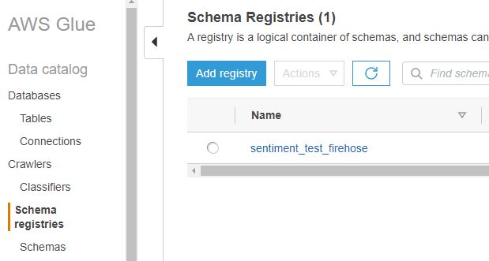
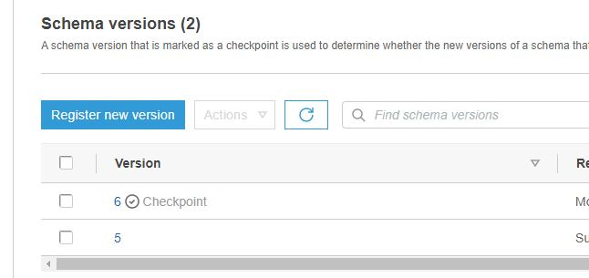
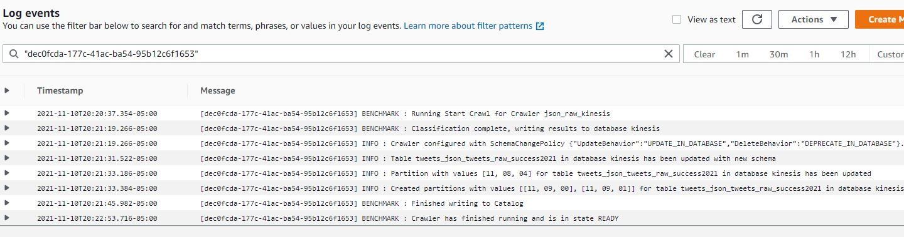
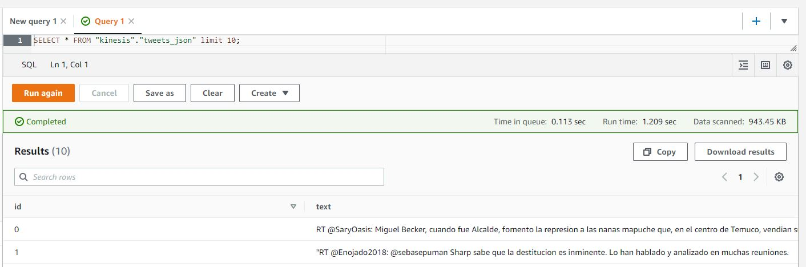

# Amazon Glue

Utilizando Glue podemos realizar la catalogación de los archivos recibidos a través de Kinesis Firehose esta catalogación nos sirve para crear tablas SQL y poder tratar la información recibida como un SQL. En nuestro ejercicio hasta el momento se recibe información de dos maneras pura de Kinesis Firehose y una transformada a través de una Lambda que se llama Kinesis DataStream.

Los pasos para realizar esta catalogación son los siguientes:

1. Crear un Registro de esquemas (recepción de datos crudos de Firehose)
2. Crear una base de datos
3. Crear y ejecutar crawlers

## Registro de Esquemas
podemos entender un esquema como un documento que le dice a Glue la estructura con la cual debe leer un archivo, para obtener información, nuestro Kinesis Firehose entrega en un formato parecido a json pero no es un json válido porque la estructura es similar a esta:
{}{}{}{}
y se rquiere que una estructura válida sea la siguiente:
\[{},{},{},{}\]
o si es un archivo `jsonlines` debería ser similar a esta:
{}
{}
{}
{}
esto puede ser catalogado por Glue sin inconvenientes pero si queremos realizar una lectura de datos para posterior en otras librerías de desarrollo tendríamos una complejidad adicional a la hora de codificar la lectura. Por este motivo debemos catalogar la información para que las tablas generadas desde el proceso nos permitan realizar un análisis más sencillo.

### Crear un esquema registry

Un registro de esquema nos permite alamacenar varios json esquema para diferente tipo de información en un key de s3 para crearlo lo que realizamos es:

y presionamos el botón "Agregar Registro", lo sifuiente que realizamos cuando creamos el registro es agregar los schemas pertenecientes a este: 

en este paso podemos tomar de muestra el esquema publicado en esta carpeta para poder jugar con la estructura de datos que se recibe  el archivo `json_schema.json` puede ayudar a que te hagas una idea general de como funciona esta sintáxis.

## Crear Base de datos

Para crear una base de datos en Glue, lo único que debemos hacer es ir a la sección de "Databases" como se puede observar en la primera imagen y presionar el botón "Add database" introducimos el nombre y presionamos el botón crear

## Crear y ejecutar Crawlers

El paso a paso para crear un crwler puede ser visto en cualquier tutorial de Glue, así que solo nos enfocaremos en los resultados de crear el crawler y algunas cosas que debes tener en cuenta.

- [x] Recuerda que el rol encargado de ejecutar este crawler debe tener permisos a S3 (puede utilizar IAM para esta tarea)
- [x] Puedes revisar el log de ejecución del crawler utilizando Cloudwatch, puede ayudar 
- [x] Al final de ejecución de cada crawler verfica que existan o tablas creadas o tablas actualizadas

por ejemplo en esta imagen se tiene una muestra del proceso de ejecución de un crawler podemos utilizar un crawler tambien sobre archivos en formato csv, más adelante observaremos una función lambda que realiza la conversión y almacenamiento de estos datos.

## Exploración de datos en Athena

Si el proceso de creación de tablas en la base de datos es correcto podemos explorar estos datos en Amazon Athena como si fueran  SQL, podemos ver un ejemplo en esta imagen:

 

con estos datos ya disponibles podemos realizar un proceso de análisis de datos en Batch de los datos utilizando Amazon SageMaker por ejemplo:
`tweet_batch_abalysis.ipynb` nos muestra un proceso básico de análisis de datos de texto

# Conclusión

Siguiendo el proceso hasta este punto tendríamos la primera parte del flujo de arquitectura que nos permite el almacenamiento y análisis de tweets en batch

