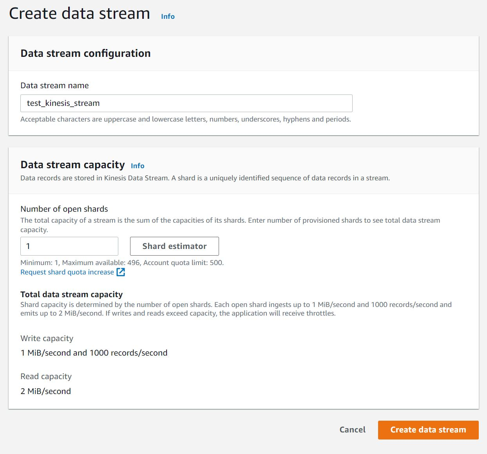
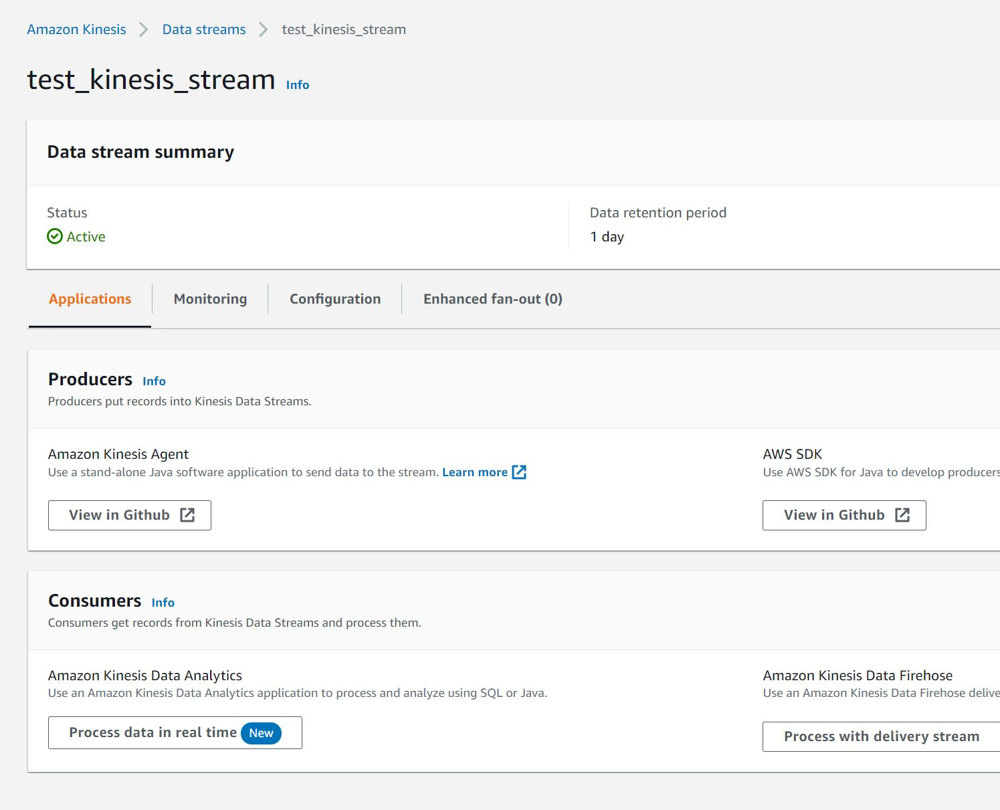

# Kinesis

En esta sección se muestra la configuración de un kinesis stream y un kinesis Firehose para el análisis de datos.

1. [Creación Kinesis Stream](#kinesis_stream)
2. [Creación Kinesis Delivery Stream](#kinesis_firehose)

## Kinesis Stream 
Para crear un Kinesis Stream entramos a la consola de Amazon Web Services a la pantalla principal de Kinesis:

En esta pantalla presionamos el botón "Create Data Stream".

En la siguiente pantalla seleccionamos el nombre del stream podemos poner el nombre "test_kinesis_stream" en el numero de shards dejamos el valor 1 por defecto

El número de shards influye directamente en la cantidad de registros que se pueden escribir por lote cada fragmento abierto puede recibir 1000 registros y al rededor de MiB por segundo así que el tamaño depende sobretodo de tu caso de uso para el test podemos tomar un solo shard para realizar las pruebas.
Una vez realizados estos pasos presionamos el botón crear y se mostrará una pantalla como la siguiente:

En esta pantalla podremos observar estadísticas del stream en ejecución entre otras.
Cuando configuremos el paso a paso de ejecución se regresará a este punto.

## Kinesis Delivery Stream 
Para configurar un Kinesis Firehose regresamos al dashboard principal de kinesis y presionamos el botón "Create Delivery Stream" tenemos 2 opciones de origen de datos podemos tomar un "Kinesis Stream" o un "Direct PUT".

### Direct PUT
En nuestra arquitectura no lo usamos pero básicamente expone kinesis Firehose como un servicio al cual se le pueden realizar peticiones PUT desde una aplicación distinta. Exige que este servicio se encuentre disponible en un security Group donde se tenga visibilidad a la url. Sin embargo su funcionamiento interno es básicamente el mismo.

Por lo tanto se explica el proceso de configuración en detalle en la otra sección.

### Delivery Stream

Toma la información que recibe un Stream los pasos de configuración son los siguientes:

Seleccionamos el stream que tomaremos de insumo y el nombre que le daremos al stream:

El siguiente paso es opcional pero puede ahorrar muchos detalles al momento de la carga pues permite seleccionar el formato como la transformación de la carga en caso de ser necesario.

En la primera parte permitimos que los datos consumidos por Firehose puedan ser procesados por una función Lambda los contenidos de esta función son mostrados en la sección de Lambda de momento nos interesa configurarlo de tal manera que los datos que pasen por este stream sean consumidos por una función lambda en este caso llamada `transform_to_json` y siempre tomará la última versión de esta función podemos saber que tan grande realizaremos será el batch de datos que recibe la función y el Buffer interval es cada cuanto se le enviaran datos a la función Lambda en este caso 60 segundos.

La segunda opción realiza la transformación de manera automática a un formato parquet o ORC en este caso seleccionamos una base de datos de Glue y la tabla donde queremos que se almacenen los datos.
Esta tabla se llama `tweets_json`

En esta sección seleccionamos el bucket, la carpeta en la cual se almacenan los resultados exitosos `carpeta_tweests_exitosos/` (en este caso es importante el slash) dentro de esta carpeta kinesis firehose creará una estructura de **año/mes/dia/hora/** para almacenar los resultados del proceso caso similar existe con los casos de error.

Para finalizar en las opciones avanzadas activamos los logs de cloudwatch que nos permiten llevar mejor trazabilidad de los errores y podemos crear un rol relacionado con los permisos de esta aplicación o separarlos ten en cuenta que el rol de kinesis en este caso debe tener acceso a S3 y a Lambda. (para agregar roles se realiza desde la consola de IAM)
Las etiquetas se consideran una buena práctica pero eso para esta aplicación que es de caracter académico no las configuramos pero en un aplicativo productivo se deben configurar.

El último paso es presionar el botón **Create Delivery Stream**

Con esto terminamos esta seción