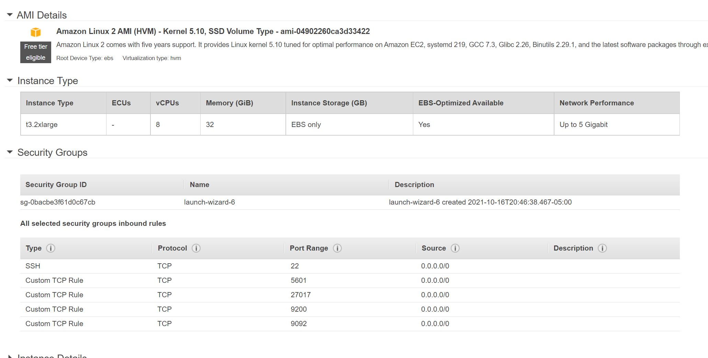

En esta sección crearemos una instancia encargada de procesar y consumir tweets entregados por kinesis stream y llevarlos a Kibana primero creamos un instancia de EC2
existen un par de tutoriales para la instalación que podemos seguir de Logstash la versión que utilizamos en el proyecto es la `7.15.1` la configuración de EC2 podemos verla en la siguiente imagen:

De la imagen notamos que tenemos abiertos varios puertos del security group a internet. En esta instancia configuraremos los 3 servicios el paso a paso adicional lo podemos consultar en el documento de word anexo en este repositorio. A partir de la **página 12**

