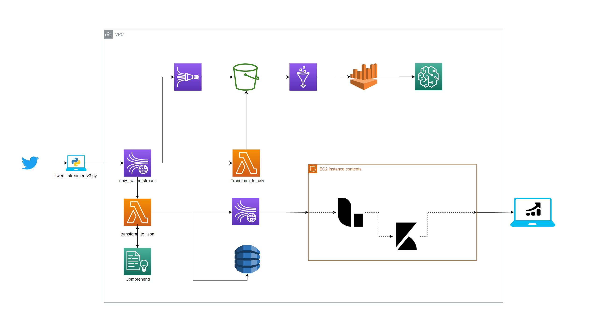

# aws_lambda_architecture_tweet_analysis
Proceso de montaje de una arquitectura Kappa para análisis de sentimientos en aws, en el año 2021

En este repositorio se almacena código y pasos de creación de una arquitectura kappa para el análisis de tweets en aws

# Caso de uso

La idea de este proyecto es llevar un proceso de consumo de datos vivos en este caso **Twitter** a AWS y montar toda una arquitectura que nos pueda ayudar al análisis de estos datos.

# 1 - Elección de una arquitectura de referencia

Para la implementación de esta arquitectura pensamos en dos opciones [Lambda](https://databricks.com/glossary/lambda-architecture) y [Kappa](https://hazelcast.com/glossary/kappa-architecture/) para nuestro caso decidimos utilizar la arquitectura **Lambda** porque nos permitía tener una opción de batch processing y otra de speed processing. En cada una de las carpetas de este repositorio se muestran las secciones del proceso, el objetivo de este proyecto es mostrar la implementación de la siguiente arquitectura de principio a fin.

# 2 - Consumo de la api de Twitter
podemos ver el paso a paso de configuración y códigos relacionados en la carpeta `Twitter`. además de un breve contexto de cada uno. Es el primer paso de este ejercicio en el cual tomamos datos de tweeter utilizando las llaves de una aplicación registrada, los transformamos y los ponemos en un kinesis stream.

# 3- Creación kinesis stream
Es el encargado de la recepción y distribución de datos en nuestra arquitectura tenemos dos tipos de servicios implementados `Kinesis Stream` y `Kinesis Firehose` en esta sección se analizan algunas de las configuraciones entre otras pueden ser examinadas en la carpeta `Kinesis`.

# 4 - Creación de Catalogos Glue
Siguiendo nuestro flujo de arquitectura en Batch los datos almacenados en Kinesis Firehose se trasladan a un bucket en s3 con los nombres que se especifican en la carpeta, estos datos se almacenan con una llave de la siguiente estructura:

$ s3_bucket/prefijo/YYYY/mm/dd/hh/ $

Para no tener que consultar cada uno de estas carpetas podemos utilizar Glue que nos permite leer la información de estos buckets y poderla trabajar como SQL en herramientas como Athena, más información de la configuración en la carpeta `Glue`

# 5 - Creación de tabla DynamoDB

Podemos crear una tabla en Dynamo para almacenar los tweets de manera rápida Dynamo no es una buena base de datos para realizar consultas SQL, pero muy rápida para obtención de registros a trtavés de claves porque es schemaless.

# 6 - Funciones Lambda
Una de las partes claves de nuestra arquitectura es AWS Lambda que es la encargada de recibir datos de Kinesis Stream parsearlos y distribuirlos en otras plataformas podemos ver más información de sobre esto en la carpeta Lambda.

