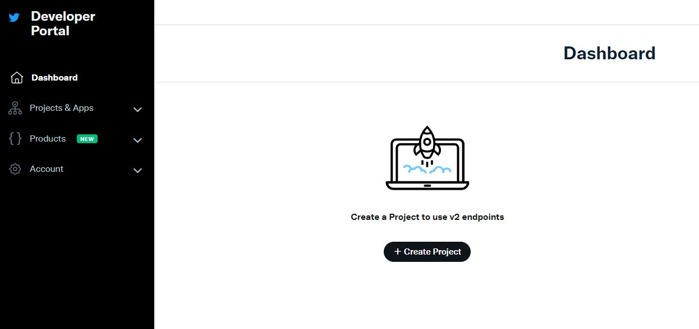
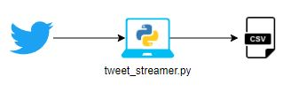
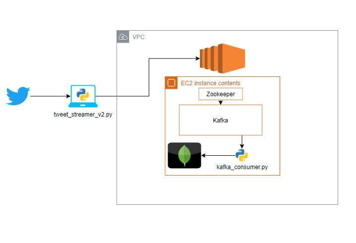
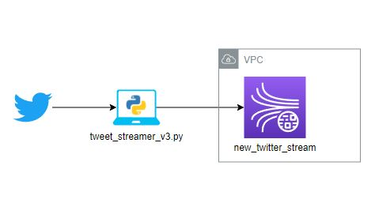

# API Twitter

En esta sección tenemos códigos y el paso a paso de configuración para el desarrollo de una aplicación que consuma datos de Twitter.

1. [Configuración inicial](#initial-config)
2. [Consumo de tweets usando Tweepy](#consuming-tweets)
3. [Ejemplos Tweepy](#examples)
	1. [Streamer versión 1](#tweet_v1)
	2. [Kafka version 2](#tweet_v2)
	3. [Kinesis version 3](#tweet_v3)


## Configuración inicial <a name="initial-config"></a>
Lo primero que debemos realizar es entrar a la página para [desarrolladores de Twitter](https://developer.twitter.com/en) y registrarnos, en el portal de desarrolladores podremos crear un nuevo proyecto:



Presionar el botón `Create Project`
En esta pagína seguimos los pasos para crear una nueva aplicación:

1. Introducir nombre del proyecto
2. Caso de uso seleccionar el que mejor defina nuestra aplicación en nuestro caso es Estudiante
3. Agregar una descripción 
4. y por último seleccionar la opción de crear una nueva app
	1. Seleccionar el nombre de la aplicación
	2. Copia y guarda tus tokens en un lugar seguro, estos son los accesos de tu aplicación a Twitter, `NO LOS PUBLIQUES EN NINGUN LUGAR`

## Consumo de tweets usando Tweepy <a name="consuming-tweets"></a>

El siguiente paso es instalar Tweepy en tu equipo o donde vayas a crear el productor de tweets en la máquina donde se ejecutará el productor, en una consola escribimos el comando:
`$ pip install tweepy`

> Debes tener en cuenta que Tweepy tiene diferentes versiones y puede que debas ajustar el código dependiendo de las versiones que utilices.

Una vez tengas instalada la librería deberías poder utilizar `import Tweepy` sin inconvenientes.

## Ejemplos de casos de uso Tweepy <a name="examples"></a>
Debido a los diferentes casos de uso que he venido trabajando tengo unas plantillas para trabajar con esta librería.

### Leer tweets y escribirlos en un archivo plano <a name="tweet_v1"></a>
El primer caso es el `tweeter_streamer.py` este archivo se conecta con la versión 3.10 de tweepy extrae tweets y lo almacena en un archivo de texto local, la única modificación que se realiza fue crear una clase que heredara del `StreamListener` para poder modificar el funcionamiento
```Python
	listener = StdOutListener(FILE_PATH, FILE_NAME,60*MINUTES)
	auth = OAuthHandler(app_credentials.CONSUMER_KEY, app_credentials.CONSUMER_SECRET)
	auth.set_access_token(app_credentials.ACCESS_TOKEN, app_credentials.ACCESS_TOKEN_SECRET)
	api = API(auth)
	stream = Stream(api.auth, listener)
```
y pasarle esta clase al stream encargado de manejar el flujo de datos. Las credenciales las guarde en un archivo de credenciales para facilitar el reuso en otras versiones. Otra opción es como guardarlas como variables de ambiente del equipo o servidor donde se está trabajando.



### Leer tweets para enviarlos a un Kafka producer <a name="tweet_v2"></a>
El segundo caso es el proceso de enviar datos a un kafka server (la configuración e instalación no se cubre en esta sección) en esta ocasión modifiqué la lógica original para utilizar la versión actual de Tweepy se realizan unos a mi StdOutListener y configure una clase que hereda de kafka producer para poder gestionar algunos eventos.
El código se encuentra en `tweeter_streamer_v2.py`
```Python
from kafka import KafkaProducer
from kafka.errors import KafkaError

class MyKafkaProducer(KafkaProducer):
	def __init__(self, server):
		super(MyKafkaProducer, self).__init__(bootstrap_servers=[server])

	def on_send_success(self, record_metadata):
		print("mensaje enviado a :" + record_metadata.topic)
		print(record_metadata.partition)

	def on_send_error(self, kafka_exception):
		print("error de kafka: " + kafka_exception)
```
de esta manera puedo agregar una función callback a la operación PUT
```Python
self.kafka_producer.send('twitter-topic', key = bytes(str(self.id), encoding='latin'), 
	value = bytes(status.text, encoding = 'utf-8'))
	.add_callback(self.kafka_producer.on_send_success).add_errback(self.kafka_producer.on_send_error)
```

De manera paralela cree un consumidor para probar que el código funcionara cuya única función era tomar el dato y almacenarlo en una base de datos de MongoDB `kafka_consumer.py` disponible en el repositorio



### Leer tweets exportar a Kinesis <a name="tweet_v3"></a>
Esta versión funciona de manera similar a las anteriores pero esta pone un tweet en Kinesis utilizando el cliente boto3 y no un endpoint como en versiones anteriores. por lo que es mas fácil de configurar.
La mayor diferencia se encuentra en la forma en la cual se envia un dato, porque el formato debe ser json y tener cuidado con los caracteres especiales y algunos formatos de fecha.

```Python
tweet_dict = {
	'id'			: self.id,
	'text' 			: ud.unidecode(status.text),
	'created_time'	: status.created_at.isoformat(),
	'source'		: status.source,
	'tweet_id'		: status.id_str,
	'user_name'		: status.user.name,
	'user_id'		: status.user.id_str,
	'run_start_time': self.start_time,
	'run_time_limit': self.limit
}

```
y el envio de datos a Kinesis
```Python
def send_to_kinesis(self, stream_name, kinesis_client, tweet_dict):
	data = tweet_dict
	kinesis_client.put_record(
		StreamName=stream_name,
		Data=json.dumps(data),
		PartitionKey="partitionkey")
```


Nótese que la imagen no menciono como consumir estos datos esto hace parte del proyecto general

## Conclusión

Estos códigos nos ayudan a tomar una fuente de datos viva e interiorizar el proceso de consumo de esta data desde un ambiente local, para este caso `Twitter` interiorizando el funcionamiento de esta parte tendremos el paso inicial para la implementación de la arquitectura
